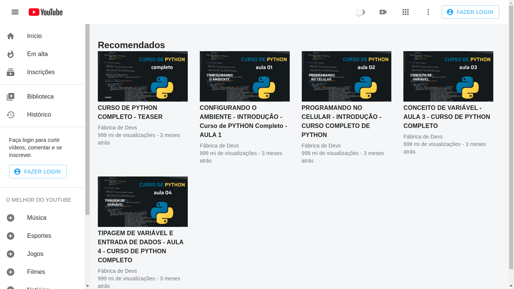

    <h1>
        Clone da Interface do Youtube
    </h1>
    

        
        
        
    

    <a href="#techs">Tecnologias</a> ▪️
    <a href="#layout">Layout</a> ▪️
    <a href="#how-to-use">Como usar</a> ▪️
    <a href="#about">Autor</a>

  

    <h2>🚀 Tecnologias</h2>
    
Neste projeto foram utilizadas as seguintes tecnologias:

    <ul>
        <li>
            <a href="https://pt-br.reactjs.org/">React JS</a>
        </li>
        <li>
            <a href="https://material-ui.com/pt/">Material-UI</a>
        </li>
    </ul>

  

    <h2>💻 Layout</h2>
    <h3>▶️ Modo Light </h3>
    
     
    <h3>▶️ Modo Dark </h3>
    

  

    <h2>❓ Como usar</h2>
    <ol>
        <li>Execute o comando: <strong>git clone https://github.com/scsSilva/youtube-clone.git</strong></li>
          
        <li>Dentro da pasta do projeto, rode o seguinte comando:
            
Se você tem o yarn instalado: <strong>yarn install</strong>

            
Se você tem o node.js instalado: <strong>npm install</strong>

        </li>
         
        <li>Execute: 
            
Se você tem o yarn instalado: <strong>yarn start</strong>

            
Se você tem o node.js instalado: <strong>npm start</strong>

        </li>
    </ol>

  

    <h2>👨‍💻 Autor</h2>
    
Sallys Carlos

    <ul>
        <li>
            <a href="mailto:sallys.carlos93@gmail.com">Gmail</a>
        </li>
        <li>
            <a href="https://www.linkedin.com/in/sallyscarlos">Linkedin</a>
        </li>
    </ul>

